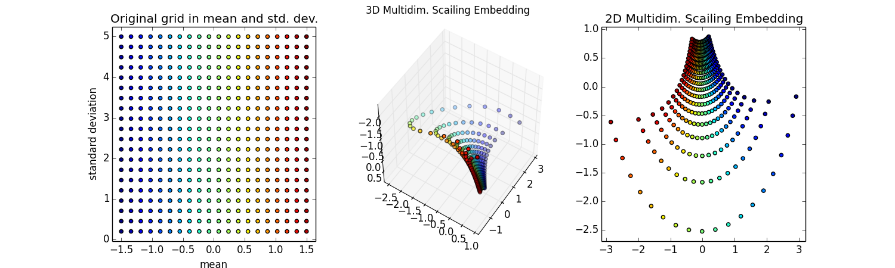
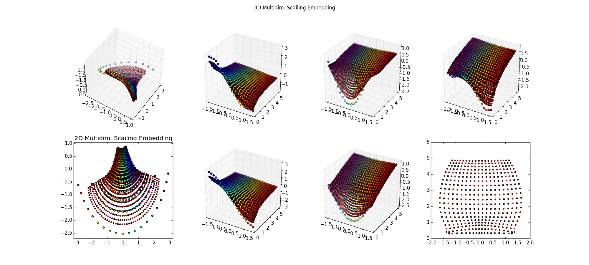
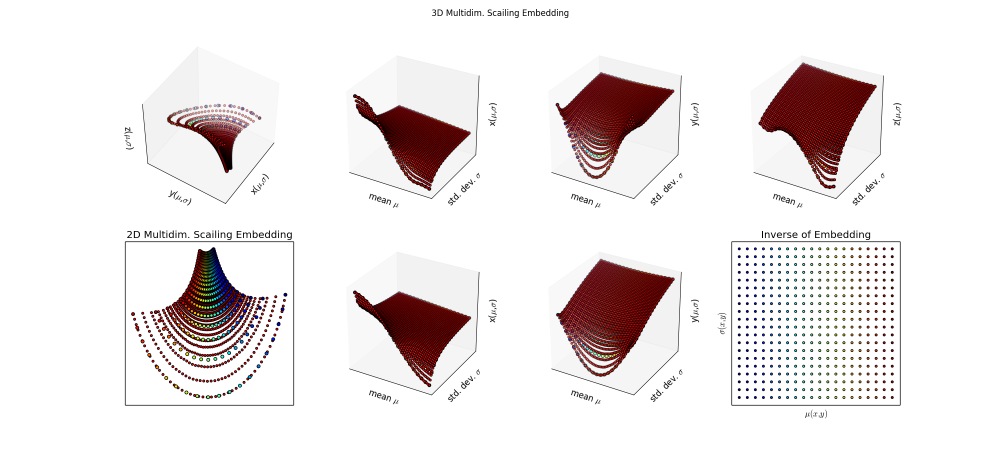

# Manifold Learning and Information Geometry

I'm working on a paper about Informtion Geometry.  
The first step was an iPython notebook on [Visualizing information geometry with multidimensional scaling](http://nbviewer.ipython.org/github/cranmer/play/blob/master/manifoldLearning/GaussianInformationGeometryEmbedding.ipynb). 

The other python files are me working my way to something more ambitious.

Step 1:
The first step is described nicely in this iPython notebook on [Visualizing information geometry with multidimensional scaling](http://nbviewer.ipython.org/github/cranmer/play/blob/master/manifoldLearning/GaussianInformationGeometryEmbedding.ipynb)

Step 2:

Try various [scikit-learn](http://scikit-learn.org/0.11/modules/generated/sklearn.svm.SVR.html) algorithms, setteling on NuSVR. Results not so good, smaller red spots not approximating the larger colorful training samples, particuarly near the edges. The lower-right is what I'm ultimately after, the inverse map of back into the space (μ,σ) -- for these points, that should be a perfect grid. Surprised I can't do regression on 

Step 3:

Since this is a low dimensional problem with little noise, just try [SciPy Interpolation](http://docs.scipy.org/doc/scipy/reference/tutorial/interpolate.html#d-interpolation-interp1d) algorithms. Ah, that's better

